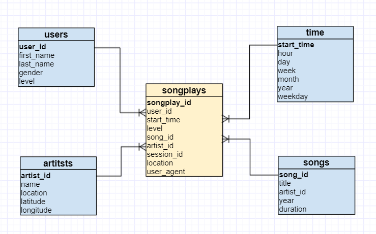

## Data Warehouse

## Background

The analytics team for music streaming startup Spakify wants to analyze the song-listening activity of their users.  This analysis will be based on mobile app JSON user activity logs and song metadata that currently exists in Amazon S3.

## Objective

The goal of this project is to build an ETL pipeline that extracts the user activity and song data from S3, stages the data in Amazon Redshift, and transforms the data into a set of dimensional tables on which the analtyics team can run queries for performing song play analysis.

## Database schema



## Project files

- `sql_queries.py` - queries for creating tables and entering data
- `create_tables.py` - drops and creates tables, used to reset tables prior to running ETL scripts
- `create_cluster.ipynb` - notebook for creating the Redshift cluster and IAM role
- `data_quality_checks.ipynb` - notebook for running queries to perform sanity checks on the tables and inserted data
- `dwh.cfg` - configuration values for AWS services

### Prerequisites

In order to run the Jupyter Notebook documents and Python files, an AWS IAM user with the following policies (or equivalent permissions) is required:
- AmazonRedshiftFullAccess
- AmazonS3ReadOnlyAccess
- IAMFullAccess
- AmazonEC2FullAccess

The access key and secret key need to be added to the `[AWS]` section in the `dwh.cfg` file.

```
[AWS]
KEY=YOURACCESSKEYGOESHERE
SECRET=PUTyourSECRETaccessKEYhereTHISisREQUIRED
```

## Steps to run project

1. Create the Redshift cluster and IAM role granting the cluster access to S3 by running the cells in the notebook `create_cluster.ipynb`

2. Run the Python file to create tables
```
python create_tables.py
```

3. Run the Python file to execute the ETL pipeline
```
python etl.py
```

4. Check that the tables were created and populated with data by running the cells in the notebook `data_quality_checks.ipynb`

### To delete AWS resources

- Run the cells at the bottom of the notebook `create_cluster.ipynb` in the section <font color="red">**Deleting the cluster and IAM role**</font>